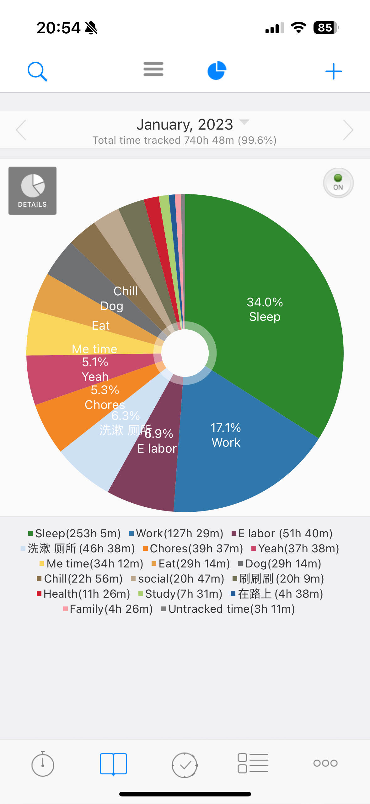

Merry Christmas and happy new year! 今年的假期在温暖的家里度过，过去一年坚持使用[aTimeLogger](http://www.atimelogger.com/)记录时间的使用情况，这篇文章简单对这些数据做一个总结吧～

- 全年看来，睡觉的比例还算健康，按照每天8小时的目标计算，31.2%也很接近33.3%了。今年最大的收获之一是随着[《纵横四海》](https://podcasts.apple.com/us/podcast/%E7%BA%B5%E6%A8%AA%E5%9B%9B%E6%B5%B7/id1671490972)博客云读了[《我们为什么要睡觉》](https://yd.qq.com/web/bookDetail/121323f0729ac578121ce6f)，深刻了解了睡眠对于激素分泌、精力、学习，甚至创伤治疗有多么重要。新的一年要更加了解自己的身体，健康睡眠。
- 2023工作处于基本躺平的状态，不卷升职不卷项目，为生活、爱好、社交腾出来了很多时间。技术上主要侧重在performance engineering，我学会了如何用[profiler](https://github.com/async-profiler/async-profiler)揪出系统里可以优化的犄角旮旯，用[JHM](https://github.com/openjdk/jmh) 衡量不同的实现到底对performance有怎样的影响，如何调试JVM使其对一个特定的系统发挥最大的优势.然而，要对工作打一个二元的分，我会给0分。总的来说，学无止境，不同领域的知识无穷尽，在新的领域收获专业技能固然重要，但是我作为一个有5年经验的软件工程师的其他技能并没有得到锻炼与提升，甚至相比于2022有所退步。
- 洗漱，居然每天平均占了一个多小时，是我实属没想到的 -- 这也告诉我们记录时间的必要性。除去洗澡、换衣服，可能有时候在马桶上蹲的时间过长了，试着以后上厕所不带手机吧～
- 在路上，包括不得不做的通勤、去办事、看医生。从国内回来之后，8月份公司要求每周去办公室至少三天，这些天日均通勤时间大约在1.5小时左右。经过一段时间的摸索，最优解是坐Caltrain，避免堵车+充分利用在火车上的时间。这样算下来，回去上班的三天里没办法利用的通勤时间就缩短到了日均20～30分钟。
- Yeah，这个分类乍一看很欢乐（实际也是），但并不能很好的反映时间的使用情况，它包括外出旅游、看影视作品，当然也包括刷剧，有时候刷剧这样短暂快乐却在完成之后带来巨大愧疚感的事情像极了刷手机。
- E labor，这个分类包括但不限于在电脑面前做的各种不得不做的杂事、调研、预约，比如缴费、更新车的注册信息、买生活必需品。2023我经常在周末处理这些杂事，一年下来竟然有惊人的418小时！它应当被拆分为学习（调研过程中做的理财功课，比较不同的产品，这类的知识以后也用得上）和实际不得不做的事情，并且在Caltrain上处理掉一部分。
- Chores, name says all，洗碗洗衣服、收拾东西，不起眼的家务也有平均每天1个多小时的刚性支出
- Eat，类似于“Yeah”，它应该被细分为“日常吃饭”，和外出社交/有场合的吃饭。
- social，family，最重要的两项社交，去年支出299+168=467小时。10月24日后，和我最好朋友的时间从social变成了family ❤️
- Dog，其中6、7、11月份没怎么遛狗
- Me time，包括了时间管理、写日记、阅读、拼乐高，简言之就是滋养自己的事情
- Chill，吃完饭窝在沙发上，刚从外面回家，结束一段家务，原来这些零零总总的时间加起来也有226个小时了，在aTimeLogger里设置了一个休息够10分钟的闹钟，希望自己以后不要忽视这个闹钟了，休息够了就赶紧起来。
- 刷刷刷，又是一个惊掉下巴的数据，195个小时，这是没有任何营养的一百多个小时，除了开始的5～10分钟是开心放松的。同上，一定要遵循自己在aTimeLogger设置的5分钟警报。另一个工具是iPhone自带的“screen time”，设置了每天1小时，Let's see how it goes.
- Health，包括健身和🙈，希望2024年的年终总结把164小时这个数字翻倍
- study，81小时，主要是在多邻国上学习日语。
- untracked，222个小时，可能是回国、travel的时候没有记录，或者年初/有段时间停用了一段aTimeLogger，2024年的目标是把它控制在2小时以内。

一月份，平平无奇的一个月，甚至想不起关键词是什么。

去[birdsong](https://www.birdsongsf.com/)给FD过了个生日，跟上一个月比，睡眠时间少了30个小时，工作时间略微增加，刷刷刷减半，工作慢慢步入正轨。

开始减肥，健身的时间多了一些，睡眠质量也随之变好，工作时长继续增加。开始看《风骚律师》了。

戴完了最后一副牙套。更多地给自己做减脂餐，被同事说瘦了，较为严格地开始执行16+8间歇性断食法，只有周末才有改善伙食的限额。

 请了两天假去纽约，每天在小红书上发减肥的进度，累计减了有5斤吧，小有成就。

🏆 六月

参加了最好的朋友的婚礼；回国了，Family这个分类的时间飙升到了39小时。见到了病危的姥姥，回了好几趟老家。

虽然身在国内，还是结结实实在国内工作了两周多。甚至工作时间比五、四月份都多。在这个月我学习了如何用JVM自带的工具检查memory leak，甚至native memory，深入研究了heap dump，收获颇丰。

这个月Work的分类是2小时！social达到了惊人的73小时，family47小时。对，我请了一个月的假，特种兵式地与家人共处、和朋友社交、全国各地游山玩水，不亦乐乎。

7月的highlight是云南雨崩，后劲太大。lowlight是几乎分手的一场亲密关系危机，几年后回看，它也许改变了我的人生吧

回归工作，开始需要每周三天回去上班。冷战，去三藩办理了许可证，看了《宇宙探索编辑部》。工作上开始接手一些杂事，颇为牵扯精力。

通勤时间每个月差不多50个小时，健身渐渐怠慢了。去了趟太浩湖，去了趟芝加哥看陈奕迅的演唱会。

睡眠非常不好，尤其FD回国的时候。化身无情的溜狗机器

☠️ 十月

陷在有毒的关系里，睡眠质量极差，日均208/31=6.7小时。认识了新的朋友，稀里糊涂结婚了，和长辈度过了一周。me time达到了38小时，因为花大量的时间了解心理学、自省和自救。几乎没有什么时间健身，6小时已经很不错了。

看了告五人的演唱会，吃了很多家常菜，也去了很多餐厅；暂时不需要遛狗了。感恩节去了一趟mendocino。

oncall之后就是延绵不断的度假和假期，大家都没什么心思工作。进入年终总结模式。

综上所述，这就是我的2023极简流水账啦。highlight是工作、社交都满分的6月，lowlight是睡眠严重不足、亲密关系亮红灯、工作频频被催的10月。正如开头所说，2024我定了很多时间管理的准则，希望新的一年能够更好地利用时间，关注职业发展，同时保持健康的生活习惯，一切都会是相互促进的正循环。

PS: aTimeLogger的可视化功能过于简陋，把side project加为2024年的resolution list了👌